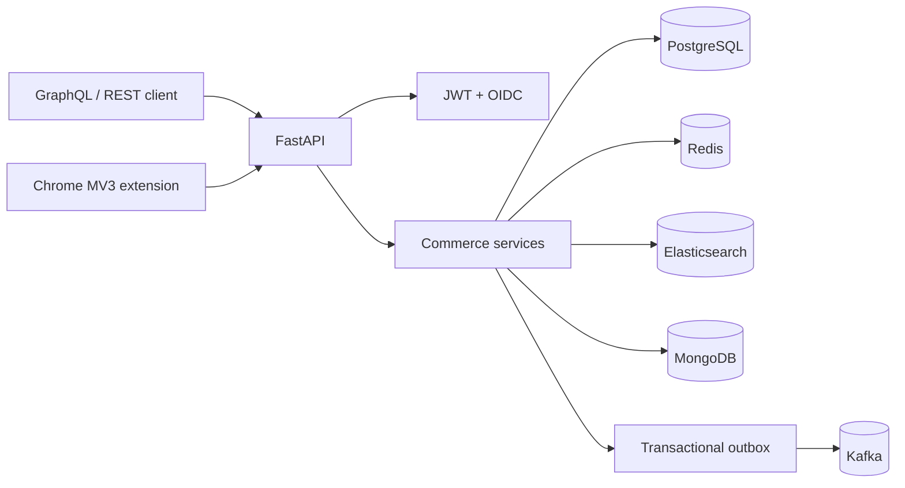

# CommercePulse

CommercePulse is an original event-driven commerce backend for collective shopping. It
combines multi-merchant search, browser-based price watches, optimistic catalog updates,
transactional orders, and time-boxed group-buy campaigns whose discount unlocks when a
member threshold is reached.

## What makes it different

Most portfolio stores stop at products and checkout. CommercePulse adds collective demand:
shoppers create or join group-buy campaigns, the backend atomically unlocks a discount at
the threshold, and downstream systems receive reliable outbox-backed Kafka events. A
Manifest V3 Chrome extension connects the product page being viewed to the same API.

## Technology responsibilities

- **FastAPI + GraphQL:** REST endpoints for auth/extension workflows and Strawberry queries/mutations
- **PostgreSQL:** users, products, watches, campaigns, memberships, orders, and transactional outbox
- **MongoDB:** flexible price-history snapshots for analytics and audit exploration
- **Elasticsearch:** fuzzy multi-field catalog search with a SQL fallback during search outages
- **Redis:** short-lived search-result caches with graceful fallback
- **Kafka:** product, watch, group-buy, and order domain events published from an outbox
- **JWT + OIDC:** local credentials and discovery-based single sign-on integration
- **Chrome Extension:** current-tab product detection and authenticated price-watch creation

## Architecture



See [architecture details](docs/architecture.md) and the
[interview preparation guide](docs/interview-guide.md).

## Quick start

```bash
docker compose up --build -d
```

- REST/OpenAPI: <http://localhost:8000/docs>
- GraphQL IDE: <http://localhost:8000/graphql>
- Readiness: <http://localhost:8000/api/v1/health/ready>
- Metrics: <http://localhost:8000/metrics>

For local Python development:

```bash
python -m venv .venv
# Windows: .venv\Scripts\Activate.ps1
python -m pip install -e ".[dev]"
alembic upgrade head
uvicorn app.main:app --reload
```

When integration URLs are absent, Redis, MongoDB, Elasticsearch, and Kafka adapters
degrade safely so the core API remains usable with SQLite/PostgreSQL. Docker Compose runs
the complete stack.

## Chrome extension

1. Open `chrome://extensions` and enable Developer mode.
2. Choose **Load unpacked** and select `extension/`.
3. Register/login through the API and paste the JWT into the popup.
4. Open a product URL already indexed in CommercePulse, then select **Detect current product**.

The committed extension is Manifest V3 and only requests active-tab, tabs, storage, and
the configured local API host permissions.

## Quality gates

```bash
python -m ruff check .
python -m ruff format --check .
python -m mypy app
python -m pytest
docker compose config -q
```

The current suite contains 11 passing tests and enforces at least 85% coverage. CI also
validates the database migration and builds the container.

## Security notes

Development secrets and unauthenticated public catalog reads are deliberate demo choices.
For production, use a secret manager, TLS, a managed OIDC provider, per-merchant ownership
checks, Kafka ACLs, network isolation, and an external outbox worker.

## Author

[Nikhilesh Sriram Ruthala](https://github.com/Nikhilesh1228)

