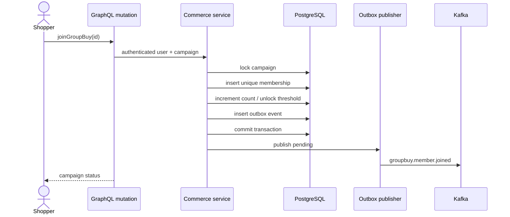

# CommercePulse architecture

## Domain boundaries

The transactional core is PostgreSQL. Product price changes, group membership, inventory
decrements, orders, and outbox records commit together, preventing events from describing
business state that never committed.

## Why each data system exists

- PostgreSQL protects money, inventory, identity, membership uniqueness, and event intent.
- MongoDB stores append-oriented price snapshots whose shape can evolve independently.
- Elasticsearch ranks/fuzzily matches text; it is rebuilt from the source-of-truth catalog.
- Redis stores disposable search ID lists. Cache loss changes latency, not correctness.
- Kafka distributes committed domain events to notification, analytics, and fulfillment consumers.

Using multiple databases is justified by distinct access patterns, not by technology count.

## Consistency decisions

Product updates use a version column and compare-and-swap update. A stale seller receives a
conflict instead of silently overwriting another change. Group membership has a database
unique constraint and row lock. Orders lock product rows, validate all inventory, create
immutable item snapshots, decrement stock, and create the outbox record in one transaction.

Kafka publication is at-least-once by design. A production consumer must use event IDs or
business keys for idempotency. The demo publishes best-effort after commit; a separate
worker should continuously drain unpublished rows in production.

## Failure behavior

- Redis down: search runs against Elasticsearch/SQL and skips cache writes.
- Elasticsearch down: catalog search falls back to SQL `ILIKE` matching.
- MongoDB down: transactional price update succeeds; history write can be retried later.
- Kafka down: outbox rows remain unpublished for retry; the business transaction remains valid.
- OIDC unavailable: local JWT login remains available.

